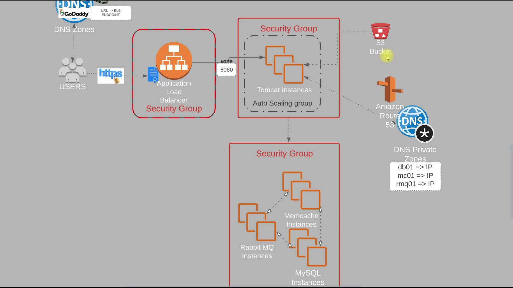
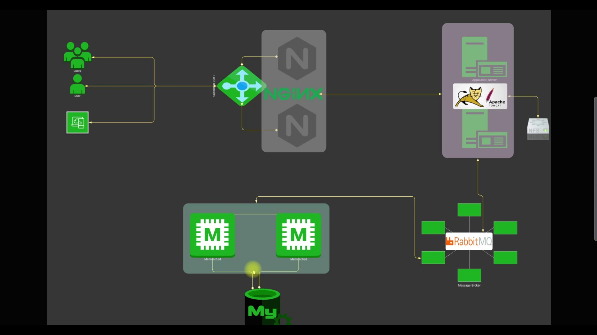

# Prerequisites
#
- JDK 11 
- Maven 3 
- MySQL 8

# Technologies 
- Spring MVC
- Spring Security
- Spring Data JPA
- Maven
- JSP
- Tomcat
- MySQL
- Memcached
- Rabbitmq
- ElasticSearch
# Database
Here,we used Mysql DB 
sql dump file:
- /src/main/resources/db_backup.sql
- db_backup.sql file is a mysql dump file.we have to import this dump to mysql db server
- > mysql -u <user_name> -p accounts < db_backup.sql

# Flow of Execution
- Login to AWS Account
- Create Key Pairs and Security Groups
- Launch Instances with user data [Bash Scripts]
- Update IP to name mapping in route 53
- Build Application from source code
- Upload to S3 bucket
- Download artifact to Tomcat Ec2 Instance
- Setup Load Balancer (ELB) with HTTPS [Cert from Amazon Certificate Manager]
- Map ELB Endpoint to website name in GoDaddy DNS
- Verify
- Build Autoscaling Group for Tomcat Instances
 
 
