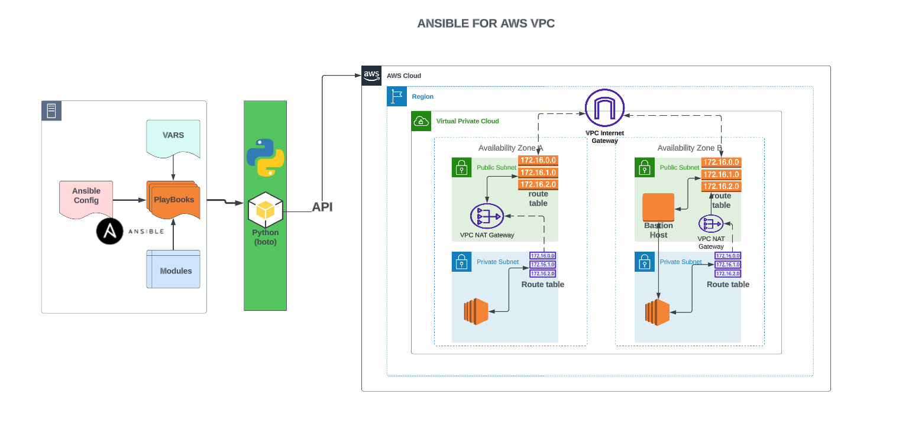

# TOOLS:
- Ansible (Ansible automation for configuration management of VPC)
- AWS (VPC setup with bastion host)

# Flow of Execution:
- Login to AWS
- Create EC2 instance to run ansible playbook
- Install Ansible
- Install boto
- Setup EC2 role for ansible
- Create a project directory
- Sample cloud task(with key pairs)
- Create variables file for VPC and bastion host
- Create VPC setup playbook
- Create bastion setup playbook
- Site.yml playbook to call both playbook at once

