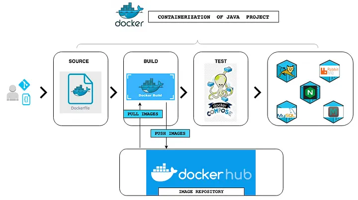
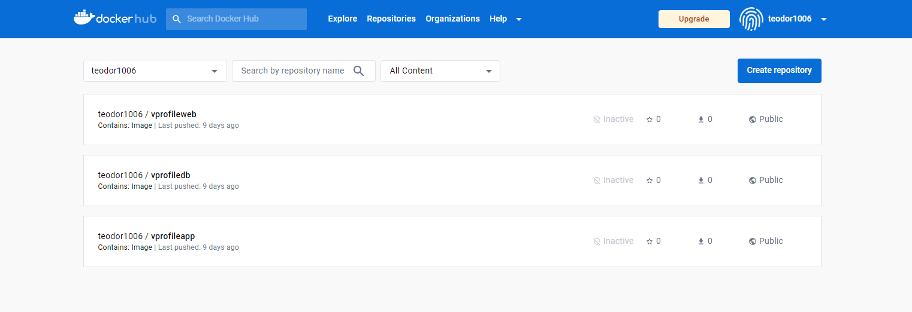
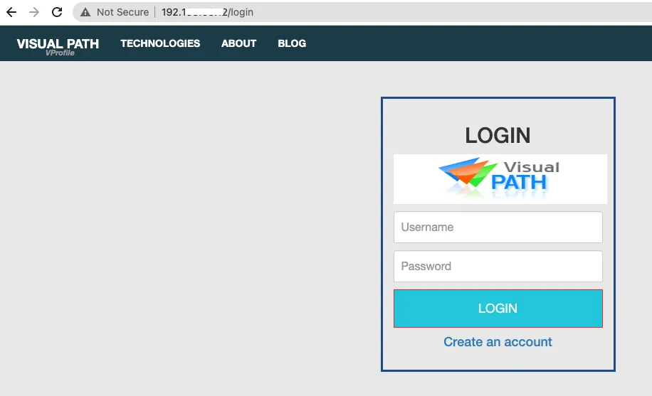

# Containerization of Java Web App using Docker

This is a DevOps project for _Containerization_ of Vprofile Project using Docker.

## Scenario - Current Situation:

- Multi Tier Application Stack

- Running on VMs

- Regular Deployments

- Continuous Changes

## Problem - Issues with Current Situation:

- Human Errors in Deployment

- Not Compatible with Microservice Architecture

- Resource Wastage

- Not Portable, Environment not in Sync

## Solution - Fix:

- Containers

- Consumes Low Resources

- Suits very well for Microservice Design

- Deployment via Images

- Same Container Images across Environments

- Reusable and Repeatable

## Tools used in the Project:

- [**Docker**](https://www.docker.com/) - Container Runtime Environment
- VirtualBox setup or AWS account to create a server to test 
- **Java Stack** - Vprofile Application Services

## Steps:

1. Steps to Setup our Stack Services.

2. Find right Base Image from Docker Hub.

3. Write `Dockerfile` to Customize Images.

4. Write `docker-compose.yml` file to Run Multi Containers.

5. Test it and Host Images on Docker Hub.

