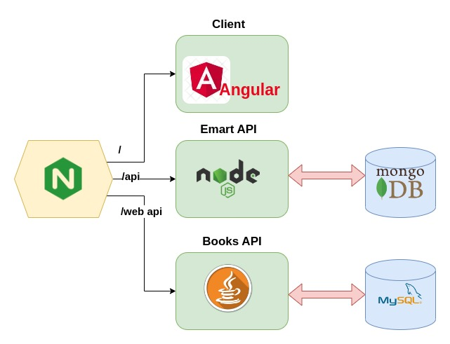
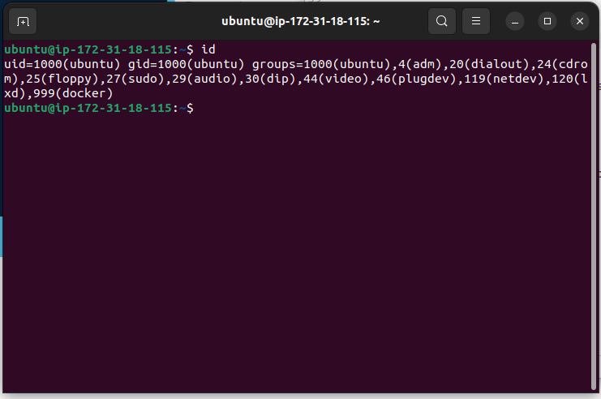
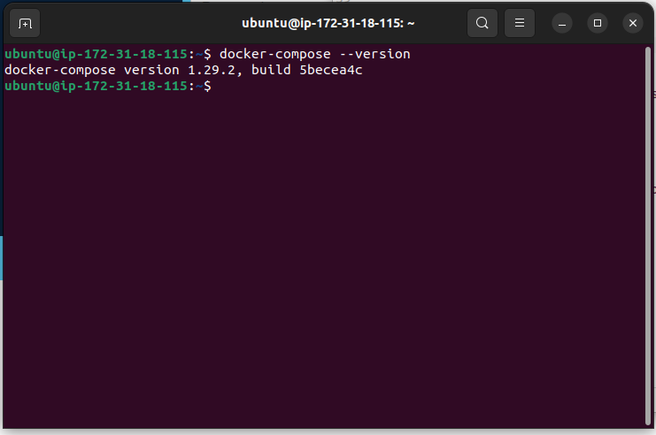

# Containerizing of Emart WebApp

This project's objective is to containerize an e-commerce web application comprised of three microservices developed in Angular, NodeJS, and Java. Nginx serves as the API gateway, dynamically routing requests based on the requested services. 

## Design

	
## Steps
 ### Clone the source code from github
 ```
 git clone https://github.com/devopshydclub/emartapp.git
 ```
 
 ### Launch one EC2 instance with the following configurations
 ```
 name: DockerEngine
 Instance type: t3.medium
 Security group: allow http from the internet, allow ssh from my ip
 Storage: 20Gb
 ```
 For user data, paste the following code:
 ```
 #!/bin/bash

# Install docker on Ubuntu
sudo apt-get update
   sudo apt-get install \
    ca-certificates \
    curl \
    gnupg \
    lsb-release -y
   curl -fsSL https://download.docker.com/linux/ubuntu/gpg | sudo gpg --dearmor -o /usr/share/keyrings/docker-archive-keyring.gpg
   echo \
  "deb [arch=$(dpkg --print-architecture) signed-by=/usr/share/keyrings/docker-archive-keyring.gpg] https://download.docker.com/linux/ubuntu \
  $(lsb_release -cs) stable" | sudo tee /etc/apt/sources.list.d/docker.list > /dev/null

# Install docker-compose
   sudo apt-get update
   sudo apt-get install docker-ce docker-ce-cli containerd.io -y
   sudo curl -L "https://github.com/docker/compose/releases/download/1.29.2/docker-compose-$(uname -s)-$(uname -m)" -o /usr/local/bin/docker-compose
   sudo chmod +x /usr/local/bin/docker-compose

# Add ubuntu user into docker group
    sudo usermod -aG docker ubuntu

```
### Configuring the running server
We first need to verify that ubuntu user has been added to the docker group, ssh into the instance, then run the command 
```
id
```

next verify docker compose installation
```
docker-compose --version
```


### Fetch source code
Clone our project repo
```
git clone https://github.com/devopshydclub/emartapp.git
```
 Now cd into emartapp
 
 ### Build and run
 We run the command to create the images
 ```
 docker compose build
 ```
 After that we can see the images using
 ```
 docker images
 ```
 To run our containers, 
 ```
 docker-compose up
 ```
 
 ### Test
 
 
 
 
 

