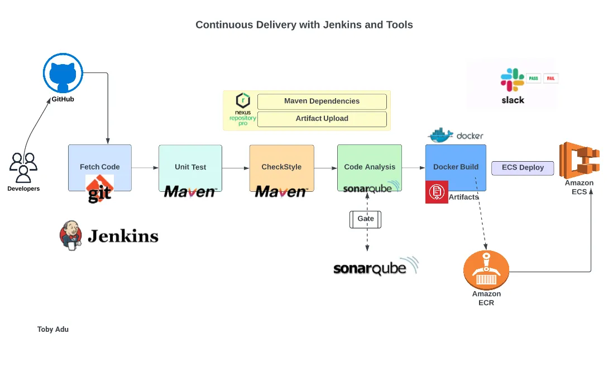
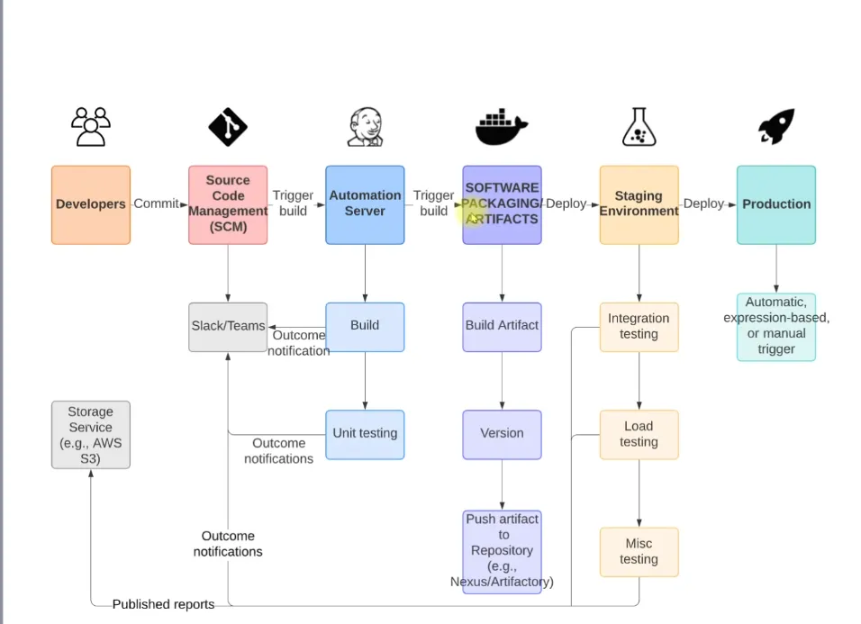

# Prerequisites
- Jenkins
- Sonarqube
- Nexus Sonartype Repository
- Maven
- Docker
- Git
- Slack
- Amazon Elastic Container Registry (ECR)
- Amazon Elastic Container Service (ECS)
- AWS CLI

# Flow of Execution
- Create/Update Github Webhook with Jenkins IP (Assuming you have completed Continuous Integration stage. see CI with Jenkins,Nexus,SonarQube & Slack).
- Copy Dockerfile files to project repository.
- Prepare Jenkinsfile for staging and Production in source code.
- AWS Steps
     a. Setup IAM User and ECR Repository
- Jenkins Steps
     a. Install plugins
        i. Amazon ECR
        ii. Docker, Docker build & publish
        iii. Pipeline: AWS steps
- Install Docker engine and AWS CLI on Jenkins server.
- Write Jenkins for Build and publish image to ECR.
- ECS Setup
    a. Cluster
    b. Task definition
    c. Service
- Write the Code to deploy Docker image to ECS.
- Repeat the step for Prod ECS cluster.
- Promoting Docker images for Production Environment.

 
 

  

