# **Mastering DevSecOps for Amazon App Deployment: Terraform, Jenkins, Docker and Kubernetes CI/CD**

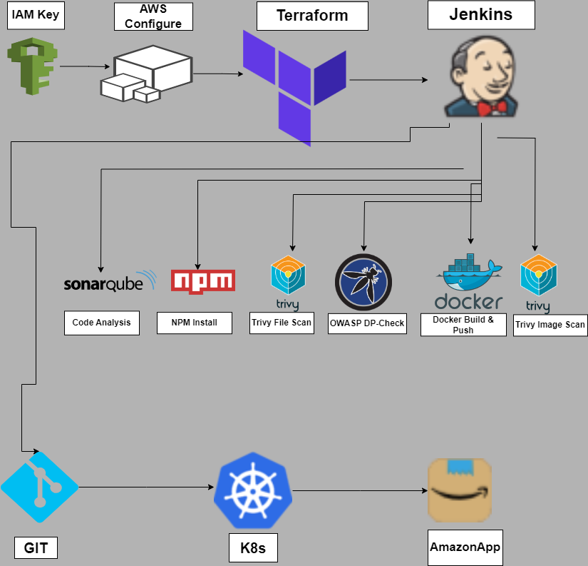

## Things you will learn 🤯

1. Creating an IAM User & Configuring AWS CLI
2. Provisioning an EC2 Instance with Jenkins via Terraform
3. Jenkins Configuration Mastery & Code Quality Analysis with SonarQube
4. Crafting a Robust CI Pipeline with Jenkins
5. Deploying ReactApp to Kubernetes with Minikube

Unleash the full potential of your DevOps skills! 🌐✨

## **Prerequisites** 

(Things to have before starting the projects)

- [x]  AWS Account.
- [x]  Dockerhub Account.
- [x]  Terraform installed on your local machine.
- [x]  Minikube & Kubernetes-CLI installed for local K8s developmenet.
- [x]  Code editor of your choice.
- [x]  GitBash installed for command-line convenience.

# Let’s Start the Project 

## **Part 1: Creating an IAM User & Configuring AWS CLI**

### **Step 1: Create IAM User**

* Open the AWS Management Console and sign in with your AWS account.

* Navigate to the IAM dashboard.

* In the left sidebar, click on "Users" and then click the "Add user" button.

* Enter a username, check "Programmatic access" for AWS CLI, and click "Next: Permissions."

* Choose "Attach existing policies directly" and select "AdministratorAccess".

* (Optional) Add tags if needed and click "Next: Review."

* Review your choices and click "Create user."

* On the user details page, go to the "Security credentials" tab.

* Under the "Access keys" section, click "Create access key."

* Download the CSV file containing the access key ID and secret access key. Keep this file secure as it will not be accessible again.

### **Step 2: Configure AWS CLI**

* Open a terminal or command prompt (In my case gitbash).

* Run the following command:

```
aws configure
```

* Enter the IAM user's access key ID & secret access key from the stored CSV File, default region and output format when prompted.

```
AWS Access Key ID [None]: YOUR_ACCESS_KEY_ID
AWS Secret Access Key [None]: YOUR_SECRET_ACCESS_KEY
Default region name [None]: us-east-1
Default output format [None]: json
```

* AWS CLI is now configured with the IAM user credentials.


## **Part 2: Provisioning an EC2 Instance with Jenkins via Terraform**

### **Step 1: Create a key pair for an Jenking EC2 Instance**

* Sign in to the AWS Management Console.

* Navigate to the EC2 dashboard.

* In the EC2 dashboard, click on "Key Pairs" in the left navigation pane under "Network & Security."

* Click the "Create Key Pair" button.

* Provide a name for your key pair in the "Key pair name" field.

* Ensure the file format is set to "PEM" (this is the standard format for key pairs).

* Click "Create Key Pair."

* Once you click "Create Key Pair," the private key file (your-key-pair-name.pem) will be automatically downloaded to your computer.

* Store the private key file in a secure location on your local machine (In my case in my project folder). This key is crucial for accessing your EC2 instances.

### **Step 2: Write a bash script for installing Jenkins, Docker, SonaqrQube & Trivy**

* **install_jenkins.sh**

```
#!/bin/bash

sudo apt update -y
wget -O - https://packages.adoptium.net/artifactory/api/gpg/key/public | tee /etc/apt/keyrings/adoptium.asc
echo "deb [signed-by=/etc/apt/keyrings/adoptium.asc] https://packages.adoptium.net/artifactory/deb $(awk -F= '/^VERSION_CODENAME/{print$2}' /etc/os-release) main" | tee /etc/apt/sources.list.d/adoptium.list
sudo apt update -y
sudo apt install temurin-17-jdk -y
/usr/bin/java --version
curl -fsSL https://pkg.jenkins.io/debian-stable/jenkins.io-2023.key | sudo tee /usr/share/keyrings/jenkins-keyring.asc > /dev/null
echo deb [signed-by=/usr/share/keyrings/jenkins-keyring.asc] https://pkg.jenkins.io/debian-stable binary/ | sudo tee /etc/apt/sources.list.d/jenkins.list > /dev/null
sudo apt-get update -y
sudo apt-get install jenkins -y
sudo systemctl start jenkins
sudo systemctl status jenkins

# Let's install Docker
sudo apt-get update
sudo apt-get install docker.io -y
sudo usermod -aG docker ubuntu  
newgrp docker
sudo chmod 777 /var/run/docker.sock
docker run -d --name sonar -p 9000:9000 sonarqube:lts-community

# Now it's time for Trivy 
sudo apt-get install wget apt-transport-https gnupg lsb-release -y
wget -qO - https://aquasecurity.github.io/trivy-repo/deb/public.key | gpg --dearmor | sudo tee /usr/share/keyrings/trivy.gpg > /dev/null
echo "deb [signed-by=/usr/share/keyrings/trivy.gpg] https://aquasecurity.github.io/trivy-repo/deb $(lsb_release -sc) main" | sudo tee -a /etc/apt/sources.list.d/trivy.list
sudo apt-get update
sudo apt-get install trivy -y
```

### **Step 3: Create an Jenkins EC2 Instance with Terraform**

* **provider.tf**

```
terraform {
  required_providers {
    aws = {
      source  = "hashicorp/aws"
      version = "~> 5.0"
    }
  }
}

provider "aws" {
  region = "us-east-1"
}
```

* **main.tf**

```
resource "aws_security_group" "jenkins-sg" {
  name        = "Jenkins Security Group"
  description = "Allow access to ports: 22, 443, 80, 8080, 9000, 3000"

  # Inbound Traffic
  ingress = [
    for port in [22, 443, 80, 8080, 9000, 3000] : {
      description      = "TLS from VPC"
      from_port        = port
      to_port          = port
      protocol         = "tcp"
      cidr_blocks      = ["0.0.0.0/0"]
      ipv6_cidr_blocks = []
      prefix_list_ids  = []
      security_groups  = []
      self             = false
    }
  ]

  # Outbound traffic
  egress {
    from_port   = 0
    to_port     = 0
    protocol    = "-1"
    cidr_blocks = ["0.0.0.0/0"]
  }

  tags = {
    Name = "jenkins-sg"
  }
}


resource "aws_instance" "webapp" {
  ami                    = "ami-0fc5d935ebf8bc3bc" # Ubuntu 22.04 
  instance_type          = "t2.large"
  key_name               = "amazon-key" 
  vpc_security_group_ids = [aws_security_group.jenkins-sg.id]
  user_data              = templatefile("./install_jenkins.sh", {})

  tags = {
    Name = "jenkins-sonar"
  }

  root_block_device {
    volume_size = 30
  }
}
```

* Put these commands in your terminal to provision

```
terraform init
terraform fmt
terraform validate
terraform plan
terraform apply
```

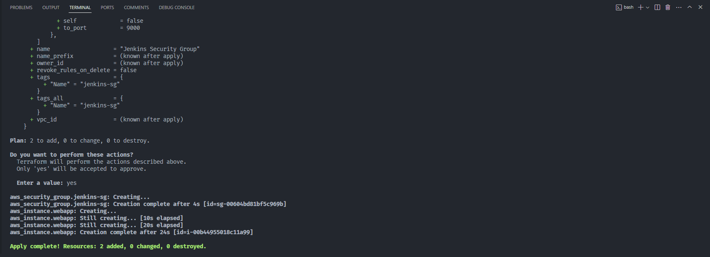
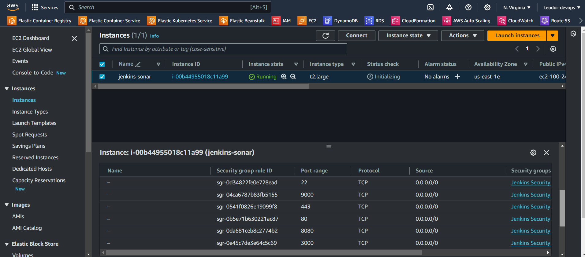

## **Part 3: Jenkins Configuration Mastery & Code Quality Analysis with SonarQube**

### **Step 1: Connect to your Jenkins EC2 Instance using SSH**

* Navigate to the EC2 dashboard.

* In the EC2 dashboard, click on "Instances".

* Find the instance you created and note its public IPv4 address.

* Open Git Bash or another terminal on your local machine.

* Use the following SSH command to connect to your EC2 instance. Replace your-key-pair.pem with the path to your private key file, and your-ec2-public-ip with the actual public IPv4 address of your EC2 instance:

```
ssh -i /path/to/your-key-pair.pem ubuntu@your-ec2-public-ip
```
* If prompted, type "yes" to confirm connecting to the instance.

* You should now be connected to your EC2 instance via SSH.

### **Step 2: Access Jenkins Web UI**

* Open your web browser and navigate to http://your-ec2-public-ip:8080. You'll find the Jenkins initial admin password in this file:


```
sudo cat /var/lib/jenkins/secrets/initialAdminPassword
```
Copy the password and paste it into the Jenkins web UI to unlock and proceed with the setup.

* Install the suggested plugins.


* Create first admin user, click on save and continue.


* Now you can see the Jenkins Dashboard.


### **Step 3: Access SonarQube Web UI**

* Open your web browser and navigate to http://your-ec2-public-ip:9000. The default login credentials are:

```
Username: admin
Password: admin
```
Change the password after logging in for the first time.

* Check trivy version in your terminal

```
trivy --version
```

### **Step 4: Install neccessary Plugins for Jenkins**

* Navigate to your Jenkins Dashboard

* Go to Manage Jenkins -> Plugins -> Available Plugins and Install the following ones:

```
Eclipse Temurin Installer
SonarQube Scanner
NodeJs Plugin
OWASP Dependency-Check
Docker
Docker Commons
Docker Pipeline
Docker API
docker-build-step
```

### **Step 5: Configure Java and Nodejs in Jenkins**

* Go to Manage Jenkins -> Tools -> JDK Installations and install the following:

```
Name: jdk17
Install from adoptium.net
Version: jdk17-17.0.8.1+1
```

* Go also to NodeJS Installations and install the following:

```
Name: node16
Install from nodejs.org
Version: NodeJS 16.2.0
```

### **Step 6: Configure SonarQube Server in Jenkins**

* Go to your SonarQube Server

* Click on Administration -> Security -> Users -> Tokens and Update Token -> Give it a Name and Generate Token

* Copy the generated token

* Go to Jenkins Dashboard -> Manage Jenkins -> Credentials -> System:

```
Kind: Secret text
Scope: Global
Secret: <your generated token>
ID: Sonar-token
Description: Sonar-token
```
Click on Create.

* Now, go to Dashboard -> Manage Jenkins -> System and add the following in "SonarQube installations":

```
Name: sonar-server
Server URL: <http://your-ec2-public-ip:9000>
Server authentication token: Sonar-token
```
Click on Apply and Save.

* Go to your Dashboard -> Manage Jenkins -> Tools -> SonarQube Scanner installations

```
Name: sonar-scanner
Install automatically from Maven Central
Version: SonarQube Scanner 5.0.1.3006
```
Click on Apply and Save.

* Now go to your SonarQube Dashboard -> Administration -> Configuration -> Webhooks -> Click on Create

```
Name: jenkins
URL: <http://your-ec2-public-ip:8080>/sonarqube-webhook/
```

### **Step 7: Configure OWASP Dependency-Check Plugin in Jenkins**

* Go to Dashboard -> Manage Jenkins -> Tools -> Dependency-Check installations

```
Name: DP
Install automatically from github.com
Version: dependency-check 6.5.1
```
Click on Apply and Save.

### **Step 8: Configure Dockerfile for Docker Image**

* Create **Dockerfile**

```
# Use the official base image
FROM node:16

# Set the working directory inside the container
WORKDIR /app

# Copy all json files starting with package to the container
COPY package*.json  ./

# Install dependencies
RUN npm install 

# Copy the rest of the code to the container
COPY . .

# Build the ReactApp
RUN npm run build 

# Expose the port on which the app will run (3000 by default)
EXPOSE 3000

# Start the app when the container starts
CMD [ "npm", "start" ]
```
* Go to Dashboard -> Manage Jenkins -> Tools -> Docker installations

```
Name: docker
Install automatically from docker.com
Docker version: latest
```
Click on Apply and Save.

* Now, go to Dashboard -> Manage Jenkins -> Credentials -> System -> Global credentials (unrestricted)

```
Kind: Username with password
Scope: Global
Username: <your-dockerhub-username>
Password: <your generated token password from dockerhub>
ID: docker
Description: docker
```
Click on Create.

## **Part 4: Crafting a Robust CI Pipeline with Jenkins**

* Create Jenkinsfile for the Pipeline

```
pipeline {
    agent any
    tools {
        jdk 'jdk17'
        nodejs 'node16'
    }
    environment {
        SCANNER_HOME=tool 'sonar-scanner'
    }
    stages {
        stage('Git Checkout') {
            steps {
               checkout scm  
            }
        }

        stage('SonarQube Analysis') {
            steps {
                withSonarQubeEnv('sonar-server') {
                    sh ''' $SCANNER_HOME/bin/sonar-scanner -Dsonar.projectName=Amazon \
                    -Dsonar.projectKey=Amazon '''
                }
            }
        }

        stage('Quality Gate') {
            steps {
                script {
                    waitForQualityGate abortPipeline: false, credentialsId: 'Sonar-token'
                }
            }
        }

        stage('Install Dependencies') {
            steps {
                sh "npm install"
            }
        }

        stage('OWASP FS SCAN') {
            steps {
                dependencyCheck additionalArguments: '--scan ./ --disableYarnAudit --disableNodeAudit', odcInstallation: 'DP'
                dependencyCheckPublisher pattern: '**/dependency-check-report.xml'
            }
        }

        stage('TRIVY FS SCAN') {
            steps {
                sh "trivy fs . > trivyfs.txt"
            }
        }

        stage("Docker Build & Push"){
            steps{
                script{
                   withDockerRegistry(credentialsId: 'docker', toolName: 'docker'){   
                       sh "docker build -t amazonapp ."
                       sh "docker tag amazonapp teodor1006/amazonapp:latest "
                       sh "docker push teodor1006/amazonapp:latest "
                    }
                }
            }
        }
        stage("TRIVY"){
            steps{
                sh "trivy image teodor1006/amazonapp:latest > trivyimage.txt" 
            }
        }

        stage('Deploy to container'){
            steps{
                sh 'docker run -d --name amazonapp -p 3000:3000 teodor1006/amazonapp:latest'
            }
        }
    }
}
```
Make sure to give your dockerhub name in stage("Docker Build & Push").

* Go to Dashboard -> Create a job -> Name (give it some name) -> Pipeline -> Click on OK


```
Pipeline from SCM
Git
URL: <url_from_project>
Branch: */main
path: Jenkinsfile
```
* Now click on your created pipeline and click on **Build Now**. The pipeline should be triggered.

* You will see the output below, with a dependency trend and results.
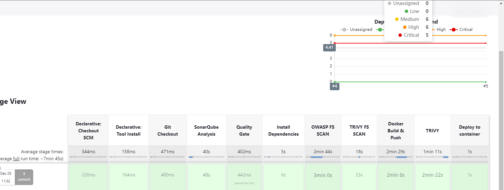

* You will also see the results in SonarQube.
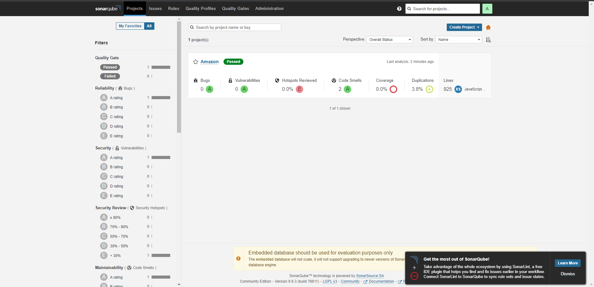

* When you log in to Dockerhub, you will see a new image is created
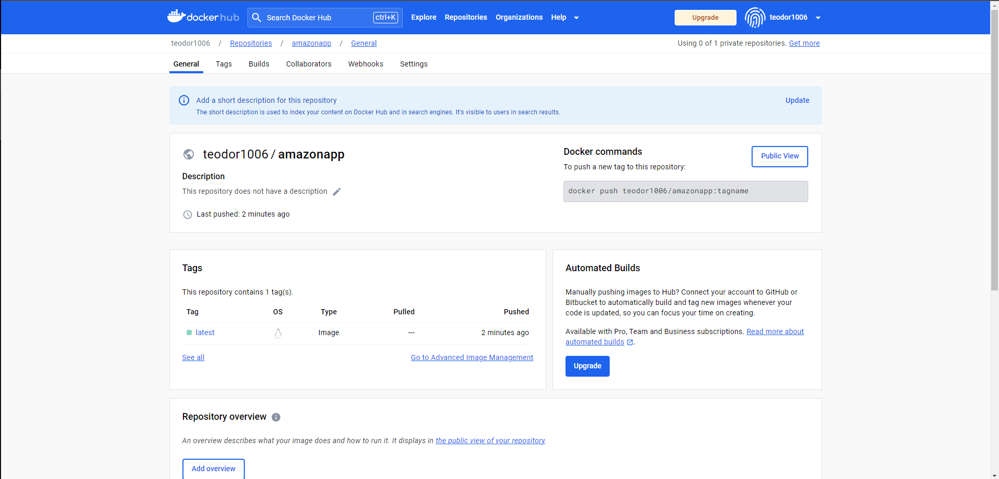

* Now test the running container: <your-ec2-public-ip:3000> and you will get this output 
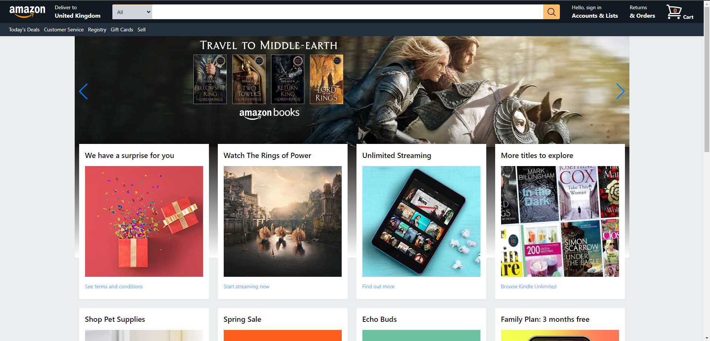

* Let's destroy everything. Go to your terminal and make sure to be in your terraform folder.
  Run this command:

  ```
  terraform destroy --auto-approve
  ```
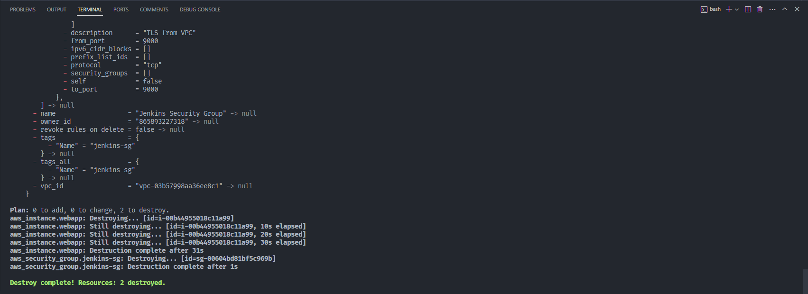

### **Part 5: Deploying ReactApp to Kubernetes with Minikube**

* Go to your GitBash Terminal and add the following to create a minikube cluster:

```
minikube start --memory=4096
```
Wait some minutes for minikube to be configured.

* Run the following command to see if the pods are up and running:

```
kubectl get pods 
```
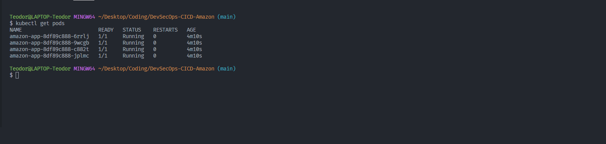

* Create Deployment-Service Manifest File for K8s

```
# Deployment 
apiVersion: apps/v1
kind: Deployment
metadata:
  name: amazon-app
spec:
  replicas: 4
  selector:
    matchLabels:
      app: amazon-app
  template:
    metadata:
      labels:
        app: amazon-app
    spec:
      containers:
      - name: amazon-app
        image: teodor1006/amazonapp:latest
        ports:
        - containerPort: 3000
        imagePullPolicy: IfNotPresent

---
# Service
apiVersion: v1
kind: Service
metadata:
  name: amazon-app-service
spec:
  selector:
    app: amazon-app
  ports:
  - protocol: TCP
    port: 80
    targetPort: 3000
  type: NodePort
```

* Run the following command to apply the manifests

```
kubectl apply -f manifests.yaml
```

* You can also access the K8s Dashboard

```
minikube dashboard
```
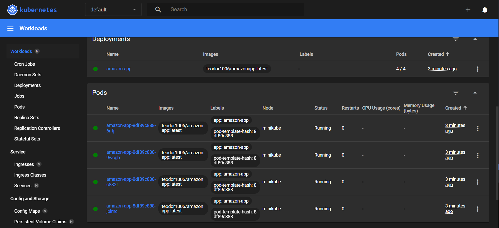

* Now use the minikube service command to get the NodePort and access the app through your browser

```
minikube service <service-name>
```
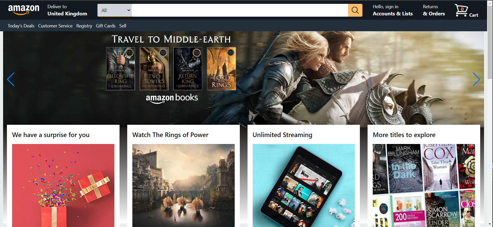


* Now let's do the Clean Up

```
kubectl delete -f manifests.yaml
minikube stop
minikube delete --all
```


