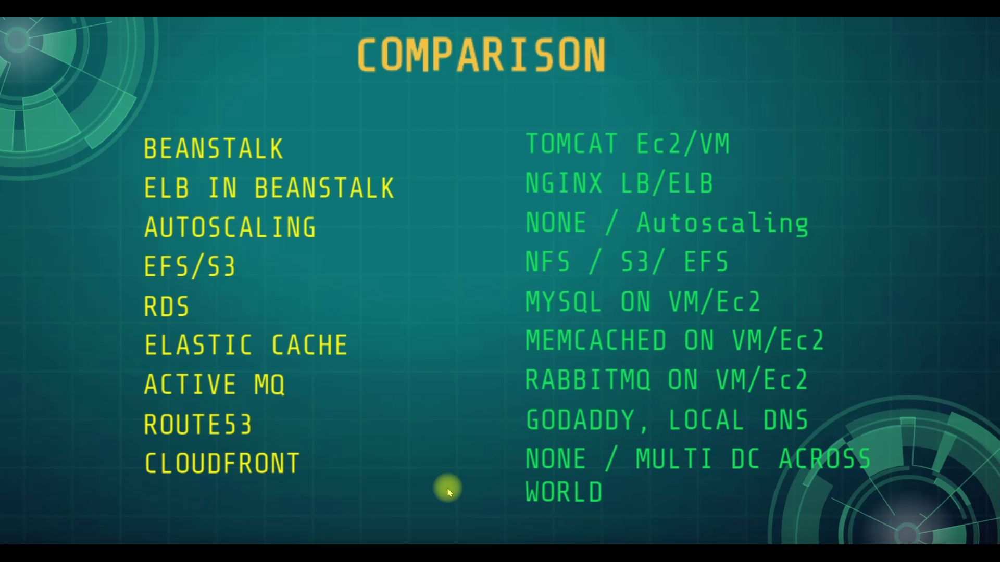
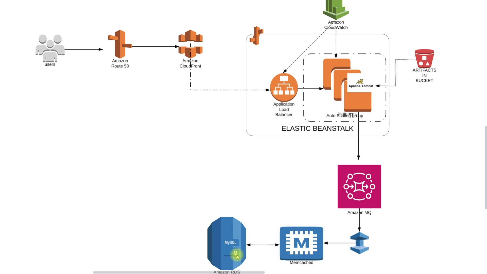

# Technologies 
- AWS Account
- Default VPC
- Route53 Public Registered Name
- Maven
- JDK8
  
# Database
Here,we used Mysql DB 
sql dump file:
- /src/main/resources/db_backup.sql
- db_backup.sql file is a mysql dump file.we have to import this dump to mysql db server
- > mysql -u <user_name> -p accounts < db_backup.sql

# Flow of Execution
- Login to AWS account
- Create key pair for beanstalk instance login
- Create Security Group for Elasticcache, RDS & ActiveMQ
- Create RDS, Amazon Elastic Cache & Amazon Active MQ
- Create Elastic Beanstalk Environmenet
- Update SG of backend to allow traffic from Bean SG
- Update SG of backend to allow internal traffic
- Launch Ec2-Instance for DB Initializing
- Login to the instance and Initialize RDS DB
- Change healthcheck on beanstalk to /login
- Add 443 https Listener to ELB
- Build Artifact with Backend Information (Maven Install)
- Deploy Artifact to Beanstalk
- Create CDN (CloudFront) with ssl cert (Certificate Manager)
- Update Entry in GoDaddy DNS Zones (You should have a domain for that step)
- Test the URL

