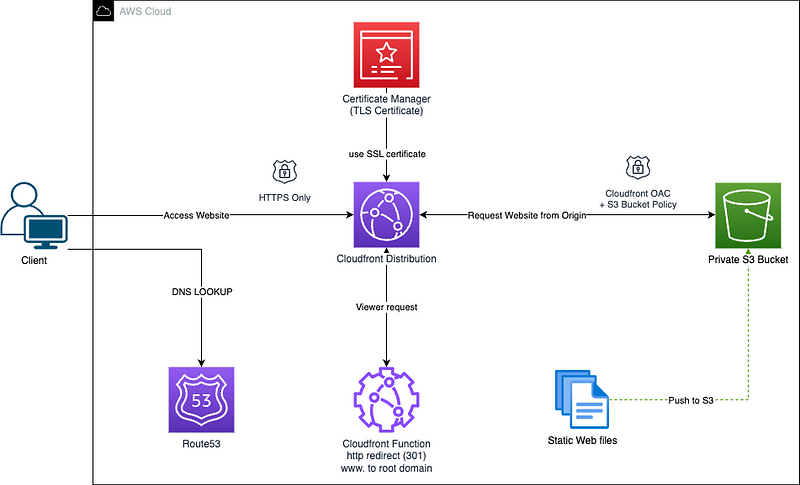
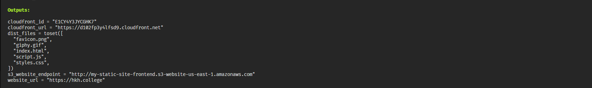
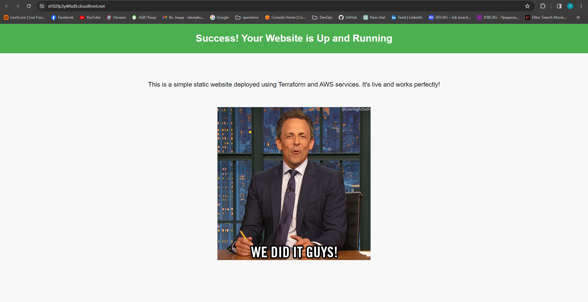

# **Static Website Hosting on AWS with Terraform**

This project establishes static website hosting on AWS through the implementation of Terraform. The design capitalizes on AWS Route 53, CloudFront, S3, Certificate Manager, and a CloudFront Function to deliver a robust, scalable, and secure solution with high availability.



* **Client:** End user accessing the website.
* **Route53:** AWS's Domain Name System (DNS) service that resolves DNS queries.
* **Certificate Manager (TLS Certificate):** Manages SSL/TLS certificates for HTTPS communication.
* **CloudFront Distribution:** Content Delivery Network (CDN) service for serving cached or original content from S3.
* **CloudFront OAC + S3 Bucket Policy:** Secures S3 bucket access to authorized CloudFront distributions using Origin Access Control (OAC).
* **CloudFront Function:** Handles HTTP redirects for domain consistency.
* **Private S3 Bucket:** Stores the website’s static assets with restricted direct public access.
* **Static Web Files:** HTML, CSS, and JavaScript files constituting the static website content.

## Prerequisites:

* AWS Account with full administrative rights 
* Terraform installed
* A foundational understanding of AWS services and Terraform basics.

## Configuring Variables

* Create a file named `terraform.tfvars` in the project root.
* This file will hold the values for the variables defined in `variables.tf`.

```
# Example terraform.tfvars content and make sure that you give your bucket a unique name

aws_region  = "us-east-2"
prefix      = "your-org-prefix"
domain_name = "yourdomain.com"
bucket_name = "website-name-frontend"
domain_name =  {
  ManagedBy = "Terraform"
  Project   = "Static Website"
}
```

## Deploy to AWS

1. Initialize Terraform
```
terraform init
```
2. Format the files if neccessary
```
terraform fmt
```
3. Validate the files
```
terraform validate
```
4. Generate an execution plan
```
terraform plan
```
5. Apply the configuration
```
terraform apply -auto-approve
```
Please note that deploying might take a while, potentially up to 30 minutes, due to CloudFront’s propagation across its extensive global server network and the necessary time for SSL certificate validation.

Once Terraform has finished deploying your infrastructure, you will see a success message with the output variables printed, as shown below.


## Confirming successful website deployment
* Now, let’s see our website in action!

* Launch your browser and navigate to your domain using HTTPS, like so: https://www.yourdoamin.com .


* Next, let’s verify that the redirection from “www” to the root domain is functioning. Type https://www.yourdoamin.com into your browser - it should seamlessly redirect you to https://yourdomain.com. This redirection is made possible thanks to the configured CloudFront functions, ensuring both better SEO and consistent user experience.

As your team grows and your projects expand, you can use Terraform workspaces to manage multiple instances of infrastructure in an isolated and organized manner. This is perfect for development, staging, and production environments.

## Clean Up
To destroy the provisioned infrastructure, use:
```
terraform destroy -auto-approve
```


